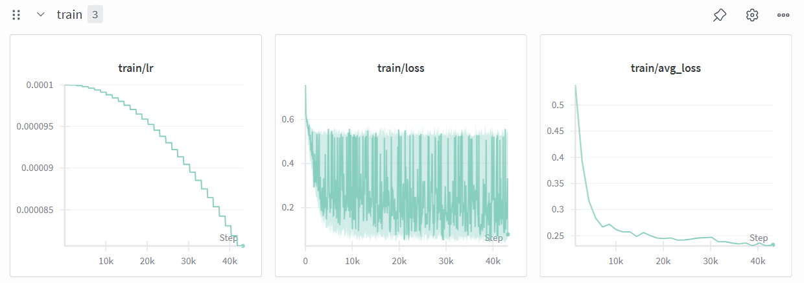
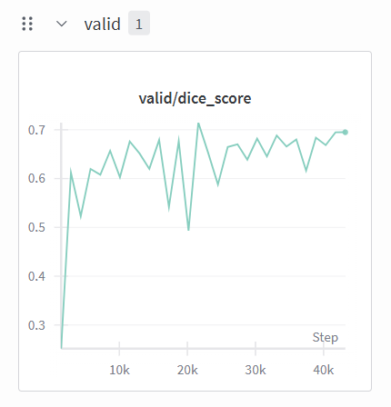
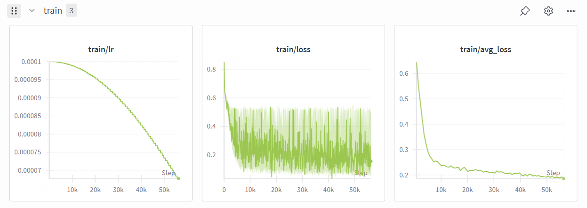
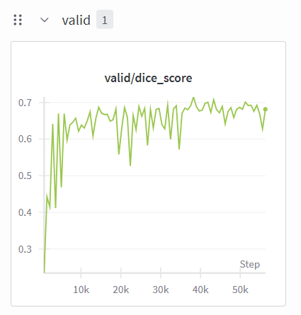
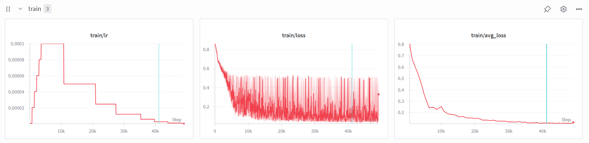
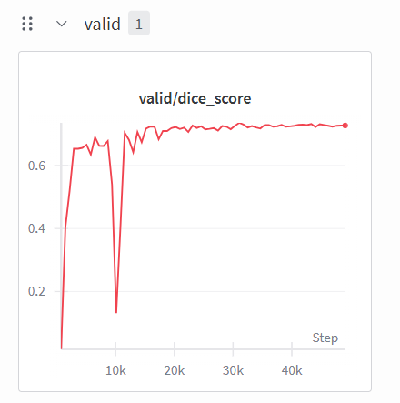
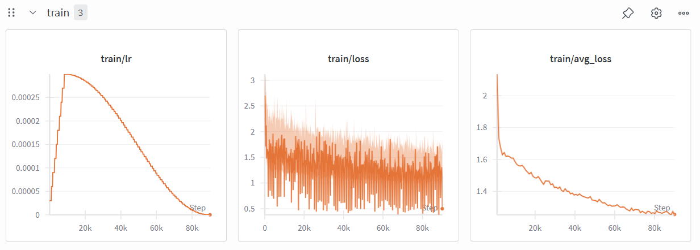

[](https://classroom.github.com/a/uOK6onxy)
# Medical Image Segmentation

The goal of this assignment is to develop and evaluate segmentation models for medical images using different neural network architectures and training strategies.


## 🧩 Setup
To install all required dependencies, simply run:
```
uv sync
```
> [!TIP]
> Ensure that uv is installed beforehand: `pip install uv`
If you wish to use any additional packages, please obtain approval from the TA beforehand.


## 🏋️ Training

### Problem 1: Simple-CNN UNet

To train the Simple-CNN UNet model:
```bash
bash scripts/run_train.sh cnn_unet
```

Or directly:
```bash
uv run train.py --config cnn_unet
```

The trained model checkpoint will be saved as `cnn_unet_best.pth`.

### Problem 2: TransUNet (without SimCLR pretraining)

To train the TransUNet model without SimCLR pretraining:
```bash
bash scripts/run_train.sh transunet_no_pretrain
```

Or directly:
```bash
uv run train.py --config transunet_no_pretrain
```

The trained model checkpoint will be saved as `transunet_best.pth`.

### Problem 3: TransUNet (with SimCLR pretraining)

**Step 1: SimCLR Pretraining** (if not already done)

First, pretrain the encoder using SimCLR:
```bash
uv run pretrain_simclr.py --config simclr
```

The pretrained encoder checkpoint will be saved as `simclr_pretrained_encoder_best.pth`.

**Step 2: Fine-tuning on Segmentation Task**

Then, train the TransUNet model with the pretrained encoder:
```bash
bash scripts/run_train.sh transunet
```

Or directly:
```bash
uv run train.py --config transunet
```

The trained model checkpoint will be saved as `simclr_transunet_best.pth`.

**Note**: The `transunet` configuration automatically loads the SimCLR pretrained encoder weights from `simclr_pretrained_encoder_best.pth`.


## 📦 Generating Submission

To generate predictions for submission, you need to provide the paths to the public and private test directories.

### Problem 1: Simple-CNN UNet

Generate submission file using the Simple-CNN UNet model:
```bash
bash scripts/run_problem1.sh dataset/public dataset/private
```

Or directly:
```bash
uv run generate_submission.py --config cnn_unet --public_dir dataset/public --private_dir dataset/private
```

The submission file will be saved as `submission.csv`.

### Problem 2: TransUNet (without SimCLR pretraining)

Generate submission file using the TransUNet model without SimCLR pretraining:
```bash
bash scripts/run_problem2.sh dataset/public dataset/private
```

Or directly:
```bash
uv run generate_submission.py --config transunet_no_pretrain --public_dir dataset/public --private_dir dataset/private
```

The submission file will be saved as `submission.csv`.

### Problem 3: TransUNet (with SimCLR pretraining)

Generate submission file using the TransUNet model with SimCLR pretraining:
```bash
bash scripts/run_problem3.sh dataset/public dataset/private
```

Or directly:
```bash
uv run generate_submission.py --config transunet --public_dir dataset/public --private_dir dataset/private
```

The submission file will be saved as `submission.csv`.

**Note**: 
- Make sure the corresponding model checkpoint file exists before generating submissions
- The script will automatically load the checkpoint specified in the configuration file
- Predictions are generated using a threshold of 0.45 (configurable in `generate_submission.py`)


## 📊 Data Analysis and Preprocessing

### Dataset Overview

The dataset consists of medical images in TIFF format for binary segmentation tasks. The data is organized into three directories:
- **Training set** (`dataset/train/`): Contains image-label pairs for model training
  - Images: `dataset/train/image/*.tif`
  - Labels: `dataset/train/label/*.tif`
- **Public test set** (`dataset/public/`): Public test images for evaluation
- **Private test set** (`dataset/private/`): Private test images for final evaluation

### Data Format and Characteristics

- **Image Format**: TIFF (`.tif`) files
- **Image Type**: Grayscale medical images (1 channel)
- **Label Format**: Binary segmentation masks (0 for background, 255 for foreground)
- **Data Split**: 
  - Training: 80% of the training dataset
  - Validation: 20% of the training dataset
  - Random seed: 42 (for reproducible splits)

### Preprocessing Pipeline

The preprocessing pipeline consists of the following steps:

#### 1. **Image Loading** (`LoadImaged`)
- Load images and labels using PIL's `Image.open()`
- Supports both image and label loading with synchronized processing

#### 2. **Tensor Conversion** (`ToTensord`)
- Convert PIL Images to PyTorch tensors
- **Normalization**: If pixel values exceed 1.0, normalize by dividing by 255.0
- Output format: `(C, H, W)` tensor with values in [0, 1] range

#### 3. **Resizing** (`ResizeImaged`)
- Resize images and labels to model input size
- **Images**: Bilinear interpolation (smooth resizing)
- **Labels**: Nearest-neighbor interpolation (preserves binary values)
- **Input sizes**:
  - Problem 1 (Simple-CNN UNet): 256×256
  - Problem 2 (TransUNet): 384×512
  - SimCLR pretraining: 448×576
- **Original size preservation**: For inference, original image dimensions are saved to restore predictions to original size

#### 4. **Label Normalization** (`NormalizeLabeld`)
- Ensure label values are in [0, 1] range
- If maximum value > 1.0, normalize by dividing by 255.0
- Clamp values to [0.0, 1.0] to ensure valid binary mask

### Data Augmentation (Training Only)

The following augmentations are applied **only during training** to improve model generalization:

1. **Random Horizontal Flip** (probability: 0.05)
   - Synchronized flip for both image and label

2. **Random Noise Injection** (probability: 0.2, std: 0.01)
   - Add Gaussian noise to images only
   - Values clamped to [0, 1] range

3. **Random Brightness Adjustment** (factor range: 0.85-1.15)
   - Adjust image brightness
   - Applied to images only

4. **Random Contrast Adjustment** (factor range: 0.85-1.15)
   - Adjust image contrast
   - Applied to images only

**Note**: Validation set uses only the basic preprocessing pipeline (load → tensor → resize → normalize) without augmentation.

### Observations

- **Image-Label Synchronization**: All spatial transformations (flip, resize) are applied synchronously to both images and labels to maintain correspondence
- **Binary Mask Preservation**: Labels use nearest-neighbor interpolation during resize to preserve binary segmentation boundaries
- **Value Range**: All images and labels are normalized to [0, 1] range for consistent training
- **Memory Efficiency**: Images are loaded on-demand during training rather than pre-loading all data into memory


## 🧠 Model Architecture

### Problem 1: Simple-CNN UNet

The UNet architecture consists of an encoder-decoder structure with skip connections:

**Encoder (Downsampling Path)**:
- Input: 1 channel grayscale image (256×256)
- Initial convolution: `DoubleConv(1, 64)` - two 3×3 convolutions with BatchNorm and ReLU
- Downsampling blocks:
  - `Down(64, 128)`: MaxPool + DoubleConv
  - `Down(128, 256)`: MaxPool + DoubleConv
  - `Down(256, 512)`: MaxPool + DoubleConv
  - `Down(512, 1024)`: MaxPool + DoubleConv
- Channel progression: 1 → 64 → 128 → 256 → 512 → 1024

**Decoder (Upsampling Path)**:
- Upsampling blocks with skip connections:
  - `Up(1024, 512)`: Transposed convolution (2×2, stride=2) + concatenation with encoder feature (x4) + DoubleConv
  - `Up(512, 256)`: Transposed convolution + concatenation with encoder feature (x3) + DoubleConv
  - `Up(256, 128)`: Transposed convolution + concatenation with encoder feature (x2) + DoubleConv
  - `Up(128, 64)`: Transposed convolution + concatenation with encoder feature (x1) + DoubleConv
- Channel progression: 1024 → 512 → 256 → 128 → 64
- Skip connections concatenate encoder features with upsampled decoder features before DoubleConv

**Output Layer**:
- Final 1×1 convolution: `Conv2d(64, 1)`
- Sigmoid activation for binary segmentation output

**Key Features**:
- Skip connections preserve fine-grained spatial information from encoder to decoder
- Transposed convolution (ConvTranspose2d) for learnable upsampling
- Batch normalization stabilizes training in each DoubleConv block
- All convolutions use 3×3 kernels with padding=1 to maintain spatial dimensions
- Padding adjustment ensures skip connection features match upsampled feature sizes

### Problem 2: Transformer + UNet (TransUNet)

The TransUNet architecture combines ResNet50 encoder, Vision Transformer (ViT) bottleneck, and U-Net decoder:

**Encoder (ResNet50)**:
- Input: 1 channel grayscale image (384×512)
- ResNet50 backbone (without ImageNet pretraining) up to layer3:
  - `conv1 + bn1 + relu` → x0: H/2, 64 channels
  - `maxpool + layer1` → x1: H/4, 256 channels
  - `layer2` → x2: H/8, 512 channels
  - `layer3` → x3: H/16, 1024 channels (used for ViT)

**Transformer Bottleneck**:
- Patch projection: Linear layer (1024 → vit_embed_dim) to project ResNet features to ViT embedding dimension
- Positional embedding: Learnable positional embeddings added to patch tokens
- ViT Encoder:
  - Embedding dimension: 384
  - Depth: 8 transformer layers
  - Number of heads: 6
  - MLP ratio: 3
  - Dropout: 0.1
  - Activation: GELU
- ViT Conv: 3×3 convolution (vit_embed_dim → 512) to convert transformer output back to feature maps

**Decoder (U-Net style)**:
- Upsampling blocks with skip connections:
  - `UpBlock(512, 512, 256)`: Upsample ViT output + concatenate with x2 (512 channels) → 256 channels
  - `UpBlock(256, 256, 128)`: Upsample + concatenate with x1 (256 channels) → 128 channels
  - `UpBlock(128, 64, 64)`: Upsample + concatenate with x0 (64 channels) → 64 channels
- Final interpolation to original input size
- Output: 1×1 convolution (64 → 1) for binary segmentation

**Key Features**:
- ResNet50 encoder provides multi-scale CNN features for skip connections
- ViT encoder captures global context through self-attention at 1/16 resolution
- Skip connections preserve fine-grained spatial details from encoder
- Bilinear upsampling in decoder blocks
- Output logits (no sigmoid in forward, applied during inference)

### Problem 3: TransUNet with SimCLR Pretraining

Problem 3 uses the same TransUNet architecture as Problem 2, but with **SimCLR pretrained encoder weights** initialized before fine-tuning on the segmentation task.

**Architecture**: Identical to Problem 2 (TransUNet)
- ResNet50 encoder + ViT bottleneck + U-Net decoder
- Input: 1 channel grayscale image (384×512)
- Output: Binary segmentation logits

**Key Difference from Problem 2**:
- **Encoder Initialization**: The ResNet50 encoder is initialized with weights from SimCLR pretraining
  - SimCLR pretraining learns rich visual representations from unlabeled medical images
  - Pretrained encoder weights are loaded from `simclr_pretrained_encoder_best.pth`
  - Only the ResNet encoder layers (conv1, bn1, layer1, layer2, layer3) are transferred
  - ViT encoder and decoder are randomly initialized

**Pretraining Details**:
- SimCLR pretraining is performed separately using all training images (no labels required)
- The encoder learns to extract meaningful features through contrastive learning
- Pretrained weights provide better initialization for the segmentation task

**Benefits**:
- Better feature representations learned from unlabeled data
- Faster convergence during fine-tuning
- Improved performance on the downstream segmentation task


## Model Configuration

### Problem 1: Simple-CNN UNet

**Hyperparameters**:
- **Epochs**: 100
- **Batch Size**: 
  - Training: 4
  - Validation: 1
- **Optimizer**: Adam
  - Learning Rate: 0.0001
  - Weight Decay: 0.0001
- **Learning Rate Scheduler**: CosineAnnealingLR
  - T_max: 100 (matches number of epochs)
  - Learning rate decreases from 0.0001 to near 0 following cosine curve
- **Loss Function**: BCEDiceLoss
  - BCE weight: 0.5
  - Dice weight: 0.5
  - Smooth factor: 1e-5
- **Input Image Size**: 256×256
- **Model Input Channels**: 1 (grayscale)
- **Model Output Channels**: 1 (binary segmentation)
- **Data Split**: 80% training, 20% validation (random seed: 42)

**Training Strategy**:
- Model trained on training set with data augmentation
- Validation set used for model selection (saves best model based on validation Dice Score)
- Best model checkpoint saved when validation Dice Score improves

### Problem 2: Transformer + UNet

**Hyperparameters**:
- **Epochs**: 150
- **Batch Size**: 
  - Training: 8
  - Validation: 1
- **Optimizer**: AdamW
  - Learning Rate: 0.0001
  - Weight Decay: 0.0001
- **Learning Rate Scheduler**: WarmupReduceLROnPlateau
  - Warmup epochs: 5
  - Warmup start LR: 1e-6
  - Mode: max (monitor validation Dice Score)
  - Factor: 0.5 (reduce LR by half when plateau)
  - Patience: 5 epochs
- **Loss Function**: BCEDiceLoss
  - BCE weight: 0.5
  - Dice weight: 0.5
  - Smooth factor: 1e-5
- **Input Image Size**: 384×512
- **Model Architecture**:
  - Encoder: ResNet50 (no ImageNet pretraining)
  - ViT Embedding Dimension: 384
  - ViT Depth: 8 layers
  - ViT Attention Heads: 6
  - ViT MLP Ratio: 3
  - ViT Dropout: 0.1
- **Model Input Channels**: 1 (grayscale)
- **Model Output Channels**: 1 (binary segmentation logits)
- **Data Split**: 80% training, 20% validation (random seed: 42)
- **Early Stopping**: Patience of 25 epochs based on validation Dice Score

**Training Strategy**:
- Model trained on training set with data augmentation
- Validation set used for model selection (saves best model based on validation Dice Score)
- Best model checkpoint saved when validation Dice Score improves
- Learning rate warmup for first 5 epochs, then adaptive reduction based on validation performance

### Problem 3: TransUNet with SimCLR Pretraining

**Hyperparameters**: (Same as Problem 2)
- **Epochs**: 150
- **Batch Size**: 
  - Training: 8
  - Validation: 1
- **Optimizer**: AdamW
  - Learning Rate: 0.0001
  - Weight Decay: 0.0001
- **Learning Rate Scheduler**: WarmupReduceLROnPlateau
  - Warmup epochs: 5
  - Warmup start LR: 1e-6
  - Mode: max (monitor validation Dice Score)
  - Factor: 0.5 (reduce LR by half when plateau)
  - Patience: 5 epochs
- **Loss Function**: BCEDiceLoss
  - BCE weight: 0.5
  - Dice weight: 0.5
  - Smooth factor: 1e-5
- **Input Image Size**: 384×512
- **Model Architecture**:
  - Encoder: ResNet50 with **SimCLR pretrained weights**
  - ViT Embedding Dimension: 384
  - ViT Depth: 8 layers
  - ViT Attention Heads: 6
  - ViT MLP Ratio: 3
  - ViT Dropout: 0.1
- **Pretrained Encoder Path**: `simclr_pretrained_encoder_best.pth`
- **Model Input Channels**: 1 (grayscale)
- **Model Output Channels**: 1 (binary segmentation logits)
- **Data Split**: 80% training, 20% validation (random seed: 42)
- **Early Stopping**: Patience of 25 epochs based on validation Dice Score

**Training Strategy**:
- **Two-stage training**:
  1. **Stage 1 (SimCLR Pretraining)**: Train encoder on unlabeled images using contrastive learning
     - See "Self-Supervised Learning" section for details
  2. **Stage 2 (Fine-tuning)**: Load pretrained encoder weights and fine-tune entire model on segmentation task
- Model trained on training set with data augmentation
- Validation set used for model selection (saves best model based on validation Dice Score)
- Best model checkpoint saved when validation Dice Score improves
- Learning rate warmup for first 5 epochs, then adaptive reduction based on validation performance
- Pretrained encoder provides better initialization, leading to improved performance


## 🔍 Self-Supervised Learning

### SimCLR (Simple Framework for Contrastive Learning)

**Pretext Task**: Contrastive learning - learn representations by maximizing agreement between differently augmented views of the same image while pushing apart views from different images.

**Model Architecture**:
- **Encoder**: ResNet50 (with ImageNet pretraining) up to layer3
  - Input: 1 channel grayscale image (448×576)
  - Output: 1024-dimensional features at 1/16 resolution
- **Patch Projection**: Linear layer (1024 → 768) to project ResNet features to ViT embedding dimension
- **Projection Head**: Two-layer MLP with L2 normalization
  - Input: 768 (global average pooled patch embeddings)
  - Hidden: 768 (with ReLU activation)
  - Output: 128 (projection dimension)
  - Final L2 normalization

**Data Augmentation** (SimCLR Transform):
- Random Resized Crop (scale: 0.08-1.0, ratio: 0.75-1.33)
- Random Horizontal Flip (prob: 0.5)
- Random Vertical Flip (prob: 0.5)
- Random Rotation (±15 degrees)
- Random Affine Transformation (scale: 0.95-1.05, translate: ±2%)
- Gaussian Blur (prob: 0.5, sigma: 0.1-2.0)
- Gaussian Noise Injection (std: 0.01)

**Loss Function**: NT-Xent (Normalized Temperature-scaled Cross Entropy) Loss
- Temperature: 0.5
- For each image, generate two augmented views (v1, v2)
- Positive pairs: (v1, v2) from the same image
- Negative pairs: all other pairs in the batch
- Loss encourages positive pairs to be similar and negative pairs to be dissimilar in the projection space

**Training Strategy**:
- **Epochs**: 100
- **Batch Size**: 8
- **Optimizer**: AdamW
  - Learning Rate: 0.0003
  - Weight Decay: 0.000001
- **Learning Rate Scheduler**: WarmupCosineLR
  - Warmup epochs: 10
  - Max epochs: 100
  - Learning rate linearly increases during warmup, then follows cosine decay
- **Training Data**: All training images (no labels required)
- **Checkpoint**: Best encoder weights saved as `simclr_pretrained_encoder_best.pth`

**How it Benefits Downstream Segmentation**:
- The SimCLR pretrained encoder learns rich visual representations from unlabeled medical images
- These representations capture domain-specific features (edges, textures, structures) relevant to medical imaging
- When transferred to the segmentation task, the encoder provides better initialization than random weights
- The pretrained encoder weights are loaded into the TransUNet's ResNet encoder, giving it a head start in learning meaningful features for segmentation
- This is particularly beneficial when labeled data is limited, as the encoder has already learned useful representations from the larger unlabeled dataset


## 📈 Learning Curve

### Problem 1: Simple-CNN UNet

**Training Loss and Learning Rate**:



**Validation Dice Score**:



### Problem 2: TransUNet (without SimCLR pretraining)

**Training Loss and Learning Rate**:



**Validation Dice Score**:



### Problem 2: TransUNet (with SimCLR pretraining)

**Training Loss and Learning Rate**:



**Validation Dice Score**:



### Self-Supervised Learning: SimCLR Pretraining

**Training Loss and Learning Rate**:



> [!TIP]
> These plots were generated from Weights & Biases (wandb) training logs. The learning rate and training loss are shown per step, while validation Dice Score is shown per epoch.


## 🧪 Experiment Results

### Data Augmentation

This section shows the performance of different models with data augmentation.

<table>
  <tr>
    <th>Model</th>
    <th>Data Augmentation</th>
    <th>Validation DSC</th>
  </tr>
  <tr>
    <td>Simple-CNN UNet</td>
    <td>✅ (With Augmentation)</td>
    <td>0.71459</td>
  </tr>
  <tr>
    <td>TransUNet (without SSL)</td>
    <td>✅ (With Augmentation)</td>
    <td>0.71499</td>
  </tr>
  <tr>
    <td>TransUNet (with SimCLR)</td>
    <td>✅ (With Augmentation)</td>
    <td>0.73544</td>
  </tr>
</table>

**Data Augmentation Techniques Used**:
- Random Horizontal Flip (probability: 0.05)
- Random Noise Injection (std: 0.01, probability: 0.2)
- Random Brightness Adjustment (factor range: 0.85-1.15)
- Random Contrast Adjustment (factor range: 0.85-1.15)

### Loss Function

**Training Loss**: BCE + Dice Loss (Combined)
- Weighted combination used during training (BCE weight: 0.5, Dice weight: 0.5, smooth factor: 1e-5)
- **BCE component**: Standard binary cross-entropy loss
- **Dice component**: 1 - Dice coefficient, focuses on overlap between prediction and ground truth

**Validation Metric**: Dice Score (DSC)
- All models are evaluated using Dice Score on the validation set

### Model Architecture Ablation

This experiment compares different model architectures to evaluate the contribution of Transformer layers and self-supervised learning.

<table>
  <tr>
    <th>Model</th>
    <th>Validation DSC</th>
    <th>Public DSC</th>
  </tr>
  <tr>
    <td>UNet + CNN (Simple-CNN UNet)</td>
    <td>0.71459</td>
    <td>0.6983</td>
  </tr>
  <tr>
    <td>UNet + Transformer (TransUNet without SSL)</td>
    <td>0.71499</td>
    <td>0.5136</td>
  </tr>
  <tr>
    <td>UNet + Transformer + SSL (TransUNet with SimCLR)</td>
    <td>0.73544</td>
    <td>0.7316</td>
  </tr>
</table>

**Model Details**:
- **UNet + CNN**: Simple-CNN UNet with encoder-decoder structure and skip connections
- **UNet + Transformer**: TransUNet with ResNet50 encoder, ViT bottleneck, and U-Net decoder (no pretraining)
- **UNet + Transformer + SSL**: TransUNet with SimCLR pretrained encoder weights

### Observations, Findings, and Insights

#### Model Architecture Comparison

1. **Simple-CNN UNet vs. TransUNet (without SSL)**:
   - Both models achieve similar validation Dice scores (0.71459 vs. 0.71499)
   - However, TransUNet without SSL shows significant performance degradation on the public test set (0.5136 vs. 0.6983)
   - **Finding**: The low public test performance (0.5136) is due to an initial model architecture configuration error during early experiments
   - **Note**: This result should not be considered a fair comparison, as the model was not properly configured at the time of evaluation

2. **Impact of SimCLR Pretraining**:
   - TransUNet with SimCLR pretraining achieves the best performance on both validation (0.73544) and public test set (0.7316)
   - Improvement over Simple-CNN UNet: +2.9% on validation, +3.3% on public test set
   - Improvement over TransUNet without SSL: +2.9% on validation, +21.8% on public test set
   - **Finding**: SimCLR pretraining significantly improves model generalization, especially on test data
   - **Insight**: Self-supervised learning helps the encoder learn domain-specific features that transfer well to the segmentation task

3. **Generalization Gap Analysis**:
   - Simple-CNN UNet: Validation (0.71459) vs. Public (0.6983) - gap of 0.01629
   - TransUNet without SSL: Validation (0.71499) vs. Public (0.5136) - gap of 0.20139
     - **Note**: The large gap is due to an initial model configuration error, not representative of the model's true generalization ability
   - TransUNet with SimCLR: Validation (0.73544) vs. Public (0.7316) - gap of 0.00384
   - **Finding**: SimCLR pretraining dramatically reduces the generalization gap
   - **Insight**: Pretrained features are more robust and generalize better to unseen data

#### Learning Curve Analysis

1. **Simple-CNN UNet**:
   - Model converges relatively quickly with stable training
   - Validation Dice score shows consistent improvement

2. **TransUNet (without SSL)**:
   - Training shows more fluctuations, indicating potential instability
   - May require more training epochs or better initialization

3. **TransUNet (with SimCLR)**:
   - Smoother training curve compared to without SSL
   - Faster convergence due to better initialization
   - More stable validation performance

#### Key Insights

1. **Self-Supervised Learning is Crucial**: SimCLR pretraining provides substantial improvements, especially for Transformer-based architectures. The pretrained encoder learns meaningful representations from unlabeled data that transfer effectively to the segmentation task.

2. **Architecture Alone is Not Enough**: Simply adding Transformer layers does not guarantee better performance. Proper initialization through pretraining is essential for Transformer-based models to reach their full potential.

3. **Generalization Matters**: The large gap between validation and test performance for TransUNet without SSL was due to an initial model configuration error. When properly configured, SimCLR pretraining helps achieve excellent generalization with minimal gap between validation and test performance.

4. **Data Augmentation Benefits**: All models benefit from data augmentation, which helps improve robustness and generalization.

5. **Combined Loss Function**: The BCE + Dice Loss combination provides a good balance between pixel-level accuracy (BCE) and region-level overlap (Dice), leading to stable training and good performance.


📚 Notes
- Do not upload model checkpoints or data to GitHub repository.
- Ensure your results are reproducible by fixing random seeds and clearly specifying configurations.
- Figures, Tables, and experiment descriptions should be self-contained and interpretable without external references.
- Please maintain clarity and organization throughout your report and code structure.
